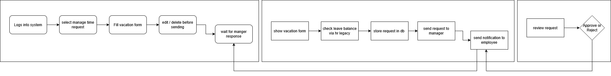

# **Vacation Tracking System (VTS)**

A Vacation Tracking System (VTS) will allow employees to manage their vacation, sick leave, and personal vacation easily, without needing to understand detailed company or facility policies.

---

## **Functional Requirements**

1. The system shall allow employees to manage their own vacation, sick leave, and personal time off without needing to understand company or facility policies.
2. The system shall give each employee the capability and responsibility to manage vacation requests in line with their employment agreement.
3. Enables manager approval (optional).
4. Enables HR and Admin to override all actions restricted by rules, with logging of overrides.
5. Allows managers to directly award personal leave time (with system-set limits).
6. The system shall validate and verify leave requests based on flexible, rule-based logic.
7. The system shall send email notifications for approval requests and status updates.
8. The system shall allow employees to view requests from the previous year and submit new ones up to 18 months ahead.
9. The system shall automate the approval process, requires at most one manual approval from the immediate manager.

---

## **Non-Functional Requirements**

1. The system must be easy to use and have a user-friendly interface.
2. The system shall improve the internal business processes by reducing the time required to manage vacation requests compared to the manual process.
3. The system shall help save time and money, especially in the HR department.
4. The system shall automate the approval process, requires at most one manual approval from the immediate manager.
5. Keeps activity logs for all transactions.

---

## **Constrain**

1. The system must interface with the existing HR legacy systems to retrieve employee information.
2. The system must provide a Web service interface for internal systems to query employee vacation summaries.
3. The system must use existing hardware and middleware.

---

## **Domain**

In the past, all vacation time had to be approved by an immediate manager and then checked by a clerk in the HR department before it was authorized. Sometimes this manual process could take days. An automated system will speed up this process and will require at most one manual approval by the immediate manager (some high-level employees may not require manager approval).

---

## **Actors**

1. Employee
2. Manager
3. HR Personal
4. System Administrator
5. HR Legacy System
6. Email Server

---

## **Assumptions**

1. All employees have access to the internal intranet.
2. A single sign-on system already exists and is used for authentication.
3. The Legacy HR system is available and supports integration.
4. Employee data in the legacy HR system is accurate and up to date.
5. The internal email system is operational and properly configured.
6. All employees and managers have active internal email accounts.
7. The organization’s existing hardware and middleware can support the new application.

---

## **Problem Domain [Boundaries]**

1. Vacation request management
2. Rules Engine
3. Email Notification
4. Activity Logging
5. HR integration Module
6. User Management

---

## **Manage Time Use Case**

### **Actors:**

* **Employee:** Initiates and manages vacation requests.
* **Manager:** Reviews and approves/rejects employee requests.
* **HR Legacy System:** Provides leave balance data and updates balances after approvals.

### **Description:**

This use case describes the process by which an employee submits, edits, or cancels a vacation request, and how it’s reviewed and processed by the manager, with leave balances validated through the HR Legacy system.

### **Main Flow:**

| **Step** | **Actor / System**     | **Description**                                                                                                  |
| -------- | ---------------------- | ---------------------------------------------------------------------------------------------------------------- |
| 1        | **Employee**           | Logs into the system and selects **“Manage Time Request”**.                                                      |
| 2        | **System**             | Displays a form for the employee to enter vacation details (duration, start date, end date, reason, etc.).       |
| 3        | **System → HR Legacy** | System checks the available leave balance through the HR Legacy system.                                          |
| 4        | **HR Legacy → System** | Sends back the leave balance information.                                                                        |
| 5        | **System**             | If the balance is sufficient, the request is stored in the database; otherwise, it is rejected.                  |
| 6        | **Employee**           | Edit or delete the request before the manager views it.                                                          |
| 7        | **System**             | Sends the request to the manager for review.                                                                     |
| 8        | **Manager**            | Opens the system, views pending requests, and chooses to **approve** or **reject** each request.                 |
| 9        | **System**             | Sends a notification to the employee with the manager’s decision (approved/rejected).                            |
| 10       | **System → HR Legacy** | If approved, the system updates the HR Legacy system and deducts the leave duration from the employee’s balance. |
| 11       | **System**             | Updates the request status to **Approved** or **Rejected** accordingly.                                          |

  <em>Flow Chart Diagram</em>

