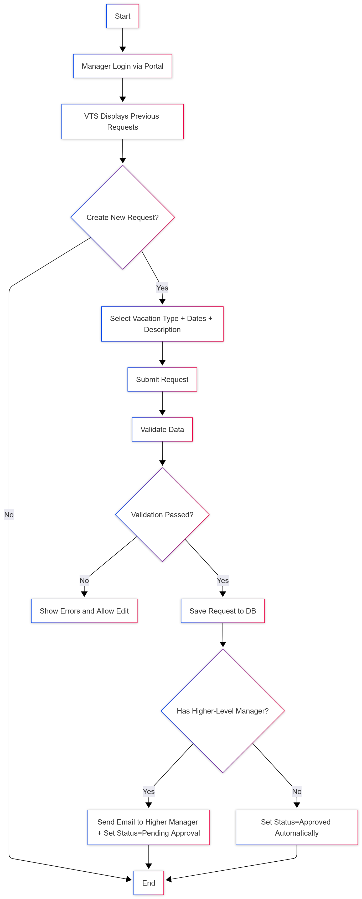
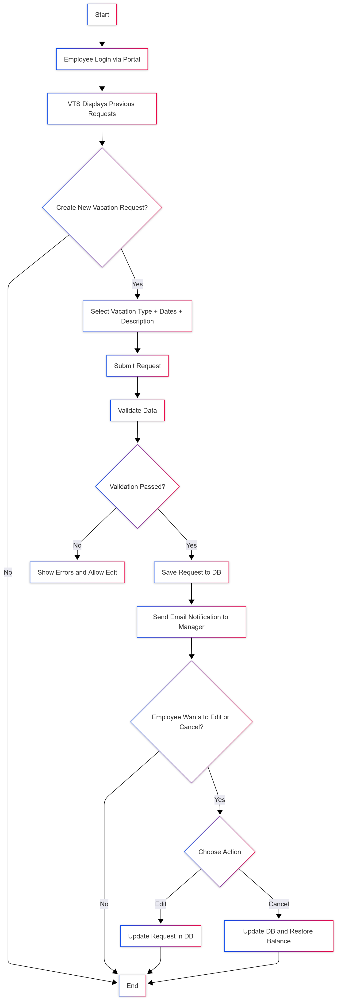
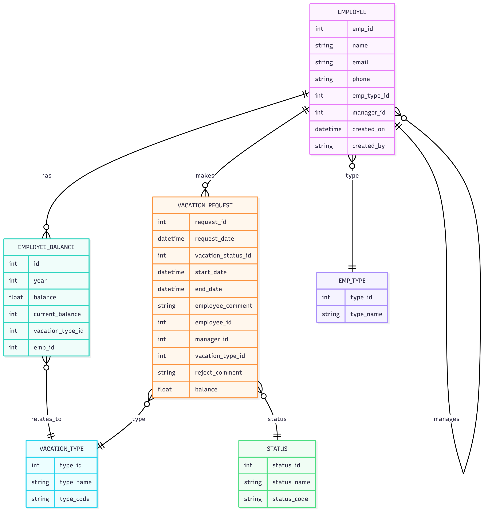
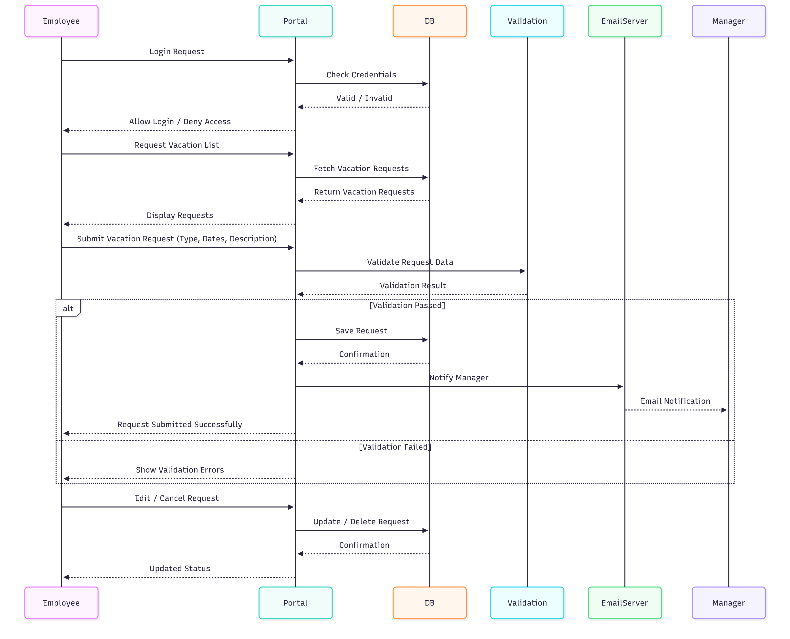
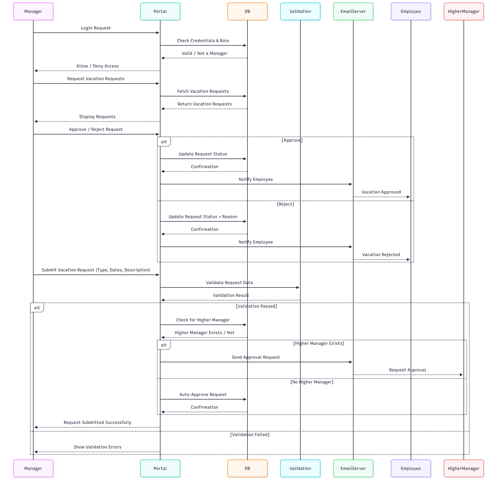
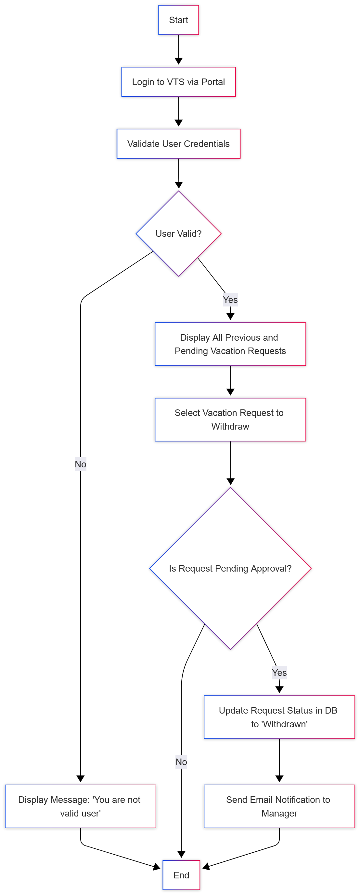
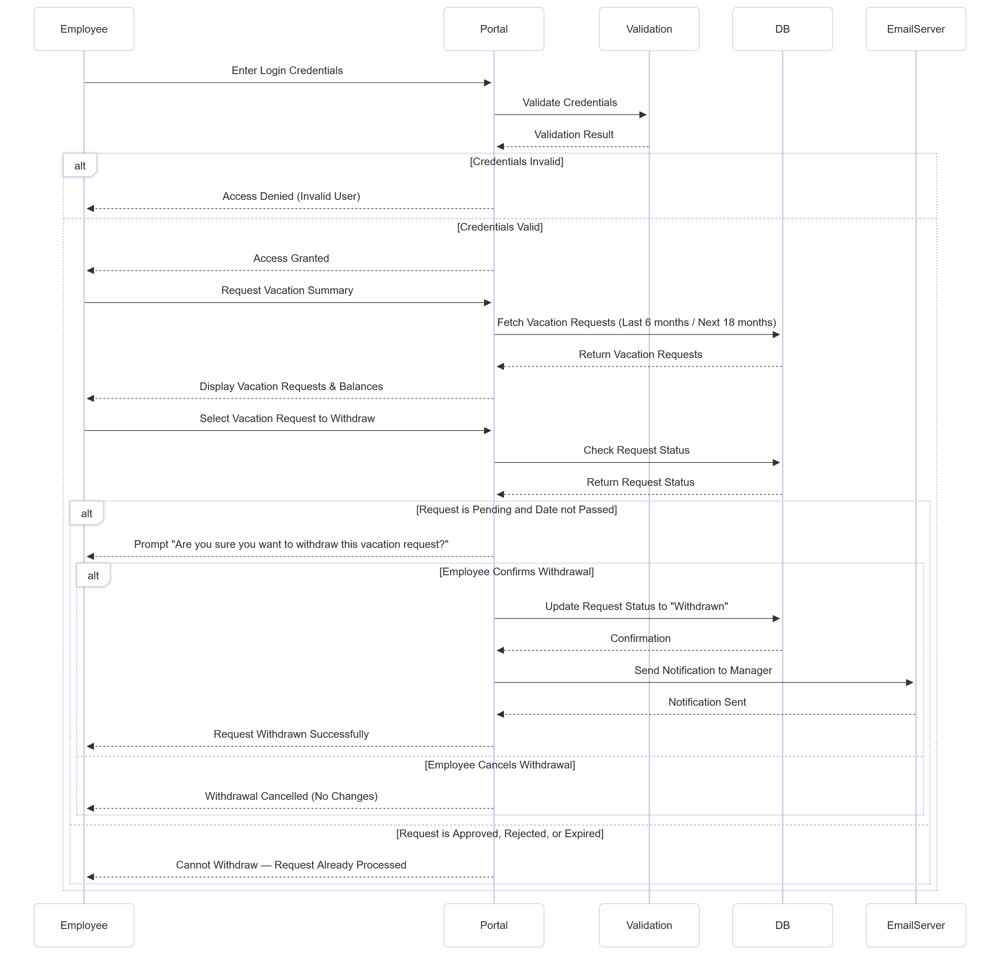
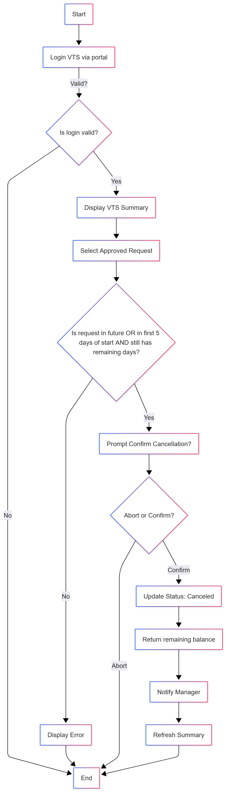
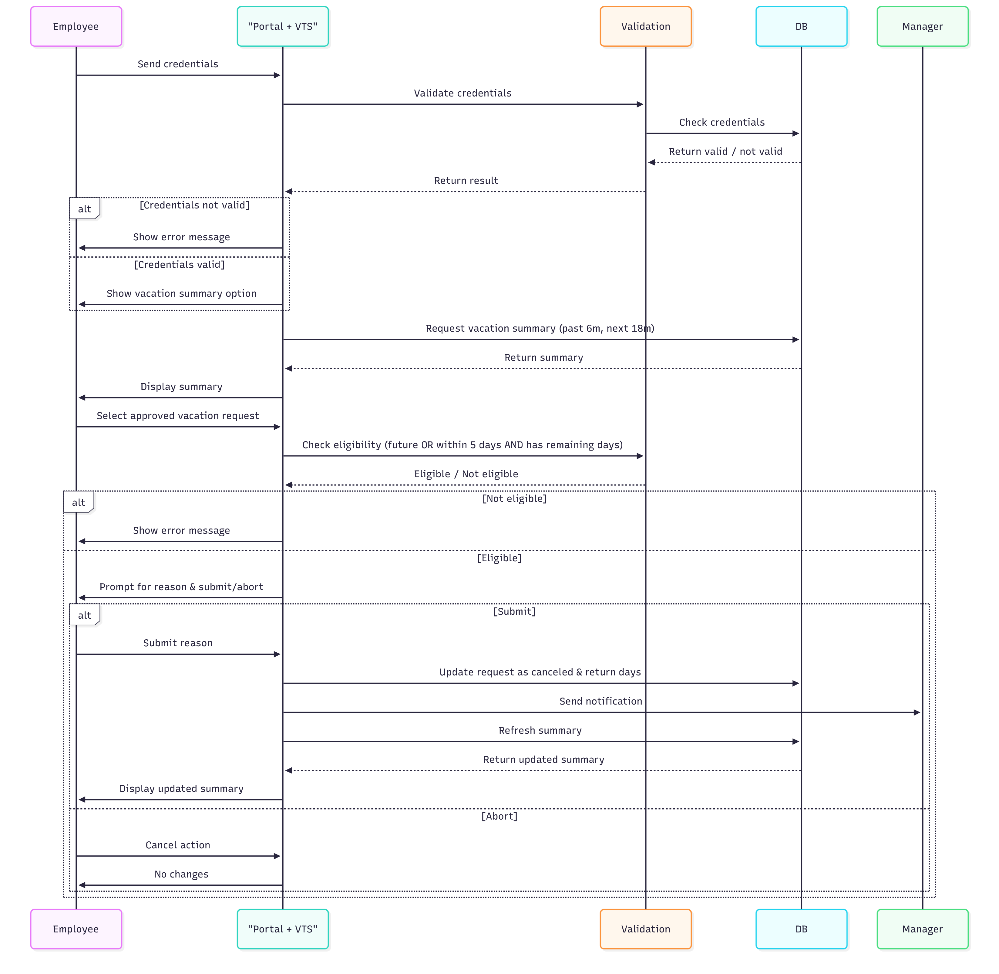

# **Vacation Tracking System (VTS)**

A Vacation Tracking System (VTS) will allow employees to manage their vacation, sick leave, and personal vacation easily, without needing to understand detailed company or facility policies.

---

## **Functional Requirements**

1. The system shall allow employees to manage their own vacation, sick leave, and personal time off without needing to understand company or facility policies.
2. The system shall give each employee the capability and responsibility to manage vacation requests in line with their employment agreement.
3. Enables manager approval (optional).
4. Enables HR and Admin to override all actions restricted by rules, with logging of overrides.
5. Allows managers to directly award personal leave time (with system-set limits).
6. The system shall validate and verify leave requests based on flexible, rule-based logic.
7. The system shall send email notifications for approval requests and status updates.
8. The system shall allow employees to view requests from the previous year and submit new ones up to 18 months ahead.
9. The system shall automate the approval process, requires at most one manual approval from the immediate manager.

---

## **Non-Functional Requirements**

1. The system must be easy to use and have a user-friendly interface.
2. The system shall improve the internal business processes by reducing the time required to manage vacation requests compared to the manual process.
3. The system shall help save time and money, especially in the HR department.
4. The system shall automate the approval process, requires at most one manual approval from the immediate manager.
5. Keeps activity logs for all transactions.

---

## **Constrain**

1. The system must interface with the existing HR legacy systems to retrieve employee information.
2. The system must provide a Web service interface for internal systems to query employee vacation summaries.
3. The system must use existing hardware and middleware.

---

## **Domain**

In the past, all vacation time had to be approved by an immediate manager and then checked by a clerk in the HR department before it was authorized. Sometimes this manual process could take days. An automated system will speed up this process and will require at most one manual approval by the immediate manager (some high-level employees may not require manager approval).

---

## **Actors**

1. Employee
2. Manager
3. HR Personal
4. System Administrator
5. HR Legacy System
6. Email Server

---

## **Assumptions**

1. All employees have access to the internal intranet.
2. A single sign-on system already exists and is used for authentication.
3. The Legacy HR system is available and supports integration.
4. Employee data in the legacy HR system is accurate and up to date.
5. The internal email system is operational and properly configured.
6. All employees and managers have active internal email accounts.
7. The organization’s existing hardware and middleware can support the new application.

---

## **Problem Domain [Boundaries]**

1. Vacation request management
2. Rules Engine
3. Email Notification
4. Activity Logging
5. HR integration Module
6. User Management

---

## **Manage Time Use Case**

### **Actors:**

* **Employee:** Initiates and manages vacation requests.
* **Manager:** Reviews and approves/rejects employee requests.
* **HR Legacy System:** Provides leave balance data and updates balances after approvals.

### 📝 **Description:**

This use case describes the process by which an employee submits, edits, or cancels a vacation request, and how it’s reviewed and processed by the manager, with leave balances validated through the HR Legacy system.

### **Main Flow:**

| **Step** | **Actor / System**     | **Description**                                                                                                  |
| -------- | ---------------------- | ---------------------------------------------------------------------------------------------------------------- |
| 1        | **Employee**           | Logs into the system and selects **“Manage Time Request”**.                                                      |
| 2        | **System**             | Displays a form for the employee to enter vacation details (duration, start date, end date, reason, etc.).       |
| 3        | **System → HR Legacy** | System checks the available leave balance through the HR Legacy system.                                          |
| 4        | **HR Legacy → System** | Sends back the leave balance information.                                                                        |
| 5        | **System**             | If the balance is sufficient, the request is stored in the database; otherwise, it is rejected.                  |
| 6        | **Employee**           | Edit or delete the request before the manager views it.                                                          |
| 7        | **System**             | Sends the request to the manager for review.                                                                     |
| 8        | **Manager**            | Opens the system, views pending requests, and chooses to **approve** or **reject** each request.                 |
| 9        | **System**             | Sends a notification to the employee with the manager’s decision (approved/rejected).                            |
| 10       | **System → HR Legacy** | If approved, the system updates the HR Legacy system and deducts the leave duration from the employee’s balance. |
| 11       | **System**             | Updates the request status to **Approved** or **Rejected** accordingly.                                          |

## 🧭 **Flow Charts**

1. **Manager – Approve/Reject Requests:**  
   Shows how the manager views vacation requests, approves or rejects them, and triggers notifications to employees.
   
<p align="center">
  
  <br>
  <em>Manager Approve/Reject Flowchart</em>
</p>


2. **Manager – Request Vacation:**  
   Describes how a manager submits their own vacation request, including validation and escalation to a higher manager if needed.

<p align="center">
  
  <br>
  <em>Manager Request Vacation Flowchart</em>
</p>

3. **Employee – Request Vacation:**  
   Explains the process for an employee to submit, edit, or cancel a vacation request.

   <p align="center">
      
      <br>
      <em>Employee Request Vacation Flowchart</em>
   </p>
   
---
## **ERD Diagram**


---


## **Sequence Diagram: Employee Requests Vacation**

**Scenario**: The employee logs into the Vacation Tracking System (VTS), views existing vacation requests, and submits a new vacation request.  
The system validates the request, updates the database, notifies the manager, and allows the employee to edit or cancel requests if needed.


<p align="center">
  <em>Sequence Diagram</em>
</p>


---

### 🧑‍💼 Manager Sequence Diagram

This sequence diagram illustrates how the manager interacts with the Vacation Tracking System (VTS).  
It shows the login and role verification process, viewing of employees’ vacation requests,  
and how the manager can approve or reject requests while sending notifications to employees.  
It also covers the scenario where the manager submits their own vacation request,  
including validation, automatic approval, or escalation to a higher manager if required.


<p align="center">
  <em>Sequence Diagram</em>
</p>

---


## **Pseudocode: Vacation Request Algorithm**

```pseudocode
BEGIN RequestVacation
    INPUT startDate, endDate
    SET daysRequested = endDate - startDate


    CALL GetBalanceFromHR(employeeID)
    SET availableBalance = returnedValue

    IF availableBalance < daysRequested THEN
        DISPLAY "Error: Not enough vacation days"
        DISPLAY "You have only " + availableBalance + " days"
        SEND Email "Request failed: insufficient balance"
        END PROCESS
    ELSE
        SET requestStatus = "Draft"
        DISPLAY "Request submitted successfully"
        DISPLAY "You can edit or cancel until manager reviews"
        SEND Email "Your request is in draft. You can modify it."

       
        CALL NotifyManager(requestID)
        SEND Email to Manager "New vacation request: ID " + requestID

        
        WAIT until Manager starts review
        SET requestStatus = "Under Review"
        DISPLAY "Request is now under review"
        DISPLAY "Editing is no longer allowed"
        SEND Email "Your request is under review. No changes allowed."

        
        IF Manager approves THEN
            CALL DeductBalanceFromHR(daysRequested)
            SET requestStatus = "Approved"
            DISPLAY "Your vacation request is APPROVED!"
            SEND Email "Approved! Enjoy your time off."
        ELSE
            SET requestStatus = "Rejected"
            INPUT rejectionReason
            DISPLAY "Request REJECTED: " + rejectionReason
            SEND Email "Rejected: " + rejectionReason
        END IF
    END IF
END
```

## 🧾 Withdraw Use Case

### 🎭 Actors:

- **Employee:** Initiates the withdrawal process for a pending vacation request.  
- **Manager:** Receives a notification when an employee withdraws a vacation request that was awaiting approval.  
- **HR Legacy System:** Maintains vacation balances and stores all vacation-related records in the central database.

---

### 📝 Description:

The *Withdraw Use Case* describes the process by which an employee withdraws a vacation request that has not yet been approved or rejected by a manager.  
This ensures that pending requests can be properly managed, keeping the system and managers updated with accurate vacation statuses.  
When an employee decides to withdraw a pending request, the system validates the user, confirms the action, updates the request status in the database, and notifies the manager via email.

---

### 🌀 Withdraw Request – Flowchart

This flowchart illustrates the steps an employee follows to withdraw a pending vacation request in the Vacation Tracking System (VTS).  
It shows how the system validates the user, checks the request status, updates the database, and notifies the manager once the request is successfully withdrawn.

<p align="center">
  
  <br>
  <em>Withdraw Request – Flowchart</em>
</p>


---

### 🔁 Withdraw Request – Sequence Diagram

This sequence diagram details the interactions between the employee, the portal, the validation service, the database, and the email server during the vacation withdrawal process.  
It demonstrates login validation, data retrieval, user confirmation, database update, and notification handling for a withdrawn vacation request.



<p align="center">
  <em>Withdraw Request – Sequence Diagram</em>
</p>

---

---

# 🧾 Cancel Approved Vacation Request

🎭 **Actors:**

* **Employee:** Initiates the cancellation of an already approved vacation request.
* **Portal + VTS:** Interface that handles authentication, validation, and display of vacation data.
* **Validation Service:** Checks credentials and confirms eligibility for cancellation.
* **Database (DB):** Stores vacation requests and updates balances.
* **Manager:** Receives an email notification when an employee cancels an approved request.

---

## 📝 **Description**

The **Cancel Approved Vacation Request** use case allows an employee to cancel a vacation request that has already been **approved**, as long as:

* The vacation **hasn’t started yet**, or
* It **started within the last 5 business days**.

When the employee confirms the cancellation, the system:

1. Updates the request status to **Canceled**
2. **Restores the used vacation days** back to the employee’s available balance
3. **Sends a notification** to the manager
4. **Refreshes the vacation summary** on the portal

If the employee chooses to abort, the system **makes no changes** and returns to the home page.

---

## 🌀 **Cancel Request – Flowchart**

This flowchart shows the step-by-step logic the employee follows when canceling an approved vacation request in the VTS:

* It starts with **logging into the system**, viewing the **vacation summary**, and selecting an approved request.
* The system checks if the request is **eligible for cancellation** (future or recent).
* The employee is then asked to **confirm or abort** the cancellation.
* If confirmed, the system updates the request, restores the vacation balance, **notifies the manager**, and refreshes the summary view.
* If not eligible or aborted, the system **shows an error or exits without changes**.

<p align="center">
  
  <br>
  <em>Cancel Flowchart Diagram</em>
</p>


---

## 🔁 **Cancel Request – Sequence Diagram**

This sequence diagram illustrates how the system components interact during the cancellation process:

* The **employee** logs into the **portal**, and credentials are validated via the **Validation Service** and **Database**.
* The portal then displays the vacation summary (covering the past 6 months and next 18 months).
* When the employee selects an approved vacation, the system checks eligibility.
* If eligible, the portal prompts the user to confirm or abort.
* Upon confirmation, the system **updates the request status**, **returns the vacation days**, **sends an email notification** to the manager, and **refreshes the summary view**.
* If canceled or aborted, no updates occur.

<p align="center">
  
  <br>
  <em>Cancel sequence diagram </em>
</p>

---

